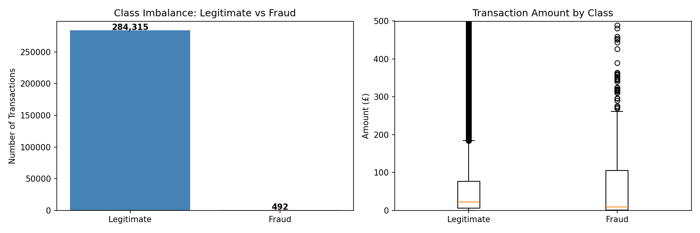
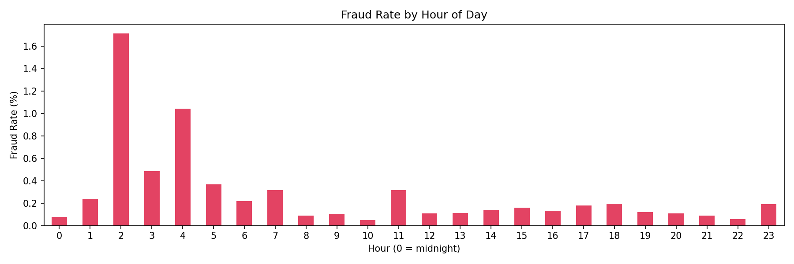
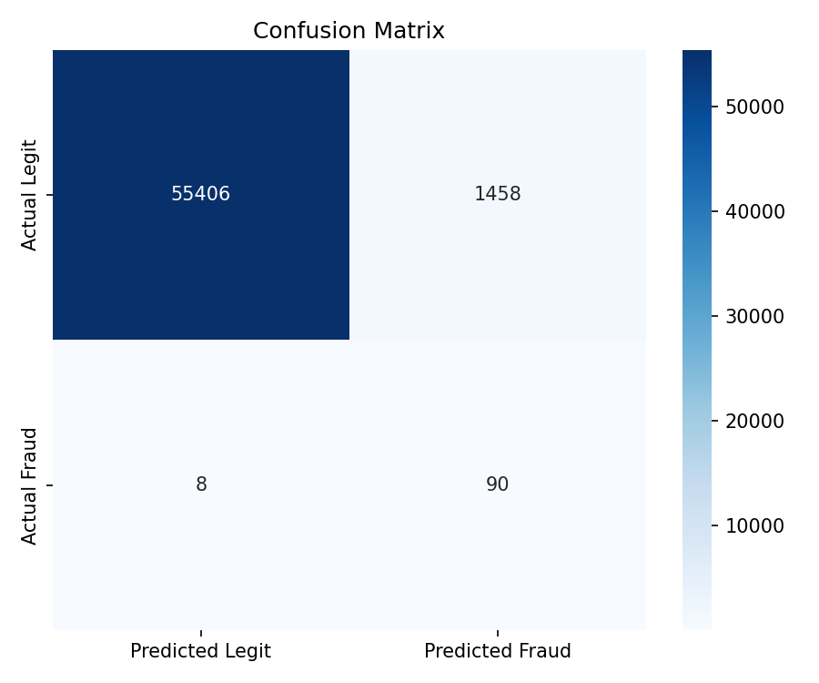
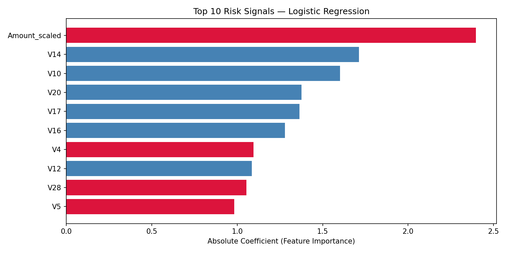

# Credit Card Fraud Pattern Analysis

Machine learning analysis of 284,807 credit card transactions to detect fraud patterns, addressing severe class imbalance using SMOTE and logistic regression.

## Results
- **Fraud recall: 94%** — model correctly identified 94% of actual fraud cases
- **Class imbalance**: 99.83% legitimate vs 0.17% fraud, handled via SMOTE resampling
- **Primary risk signals**: transaction timing and amount identified as top fraud predictors via feature importance analysis

## Charts
| Class Imbalance | Fraud Rate by Hour |
|---|---|
|  |  |

| Confusion Matrix | Feature Importance |
|---|---|
|  |  |

## Approach
1. **Exploratory analysis** — visualised class imbalance and transaction patterns by hour and amount
2. **Feature engineering** — scaled `Amount` and `Time` using StandardScaler; extracted hour-of-day as a risk signal
3. **SMOTE resampling** — synthetically oversampled fraud cases to balance training data
4. **Logistic regression** — trained baseline classifier optimised for recall (minimising missed fraud)
5. **Feature importance** — analysed model coefficients to surface primary behavioural risk signals

## Tech Stack
- Python, Pandas, NumPy
- Scikit-learn (LogisticRegression, StandardScaler, train_test_split)
- Imbalanced-learn (SMOTE)
- Matplotlib, Seaborn

## Dataset
[Credit Card Fraud Detection](https://www.kaggle.com/datasets/mlg-ulb/creditcardfraud) — ULB Machine Learning Group via Kaggle.
Download `creditcard.csv` and place in the root directory before running.

## Run
```bash
pip install pandas numpy matplotlib seaborn scikit-learn imbalanced-learn
python fraud_script.py
```